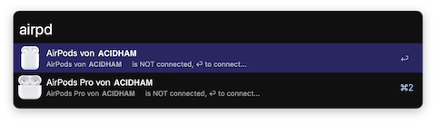

# AirPod Connector

Another Alfred AirPod Connector which requires no configuration and supports more than one AirPods

Supports AirPod1/2, AirPod Pro

Usage: `airpd`

## Required

* Python 3

## TIP

To show connection status on Desktop use Uebersicht, check it out:

1. Uebersicht: https://github.com/felixhageloh/uebersicht
2. Uebersicht-Widget: https://github.com/Acidham/uebersicht-airpod-status

